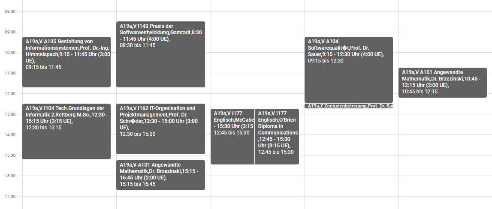

# 🗓️ Schedule Cleaner

[](https://nak.coderesting.dev/)
[](https://github.com/jeff-saupe/ScheduleCleaner/blob/master/LICENSE)
[](https://github.com/jeff-saupe/ScheduleCleaner/issues)
[](https://github.com/jeff-saupe/ScheduleCleaner/releases)



# 📖 Usage

There are currently **three** ways to use the **Schedule Cleaner**.

## 🧾 Option 1 | Import or download by URL

This option allows you to **automatically import** or just **download** the cleaned calendar by URL - without touching any code!

There are **two** ways to create your schedule URL:

1. Visit [schedule-cleaner.herokuapp.com](https://schedule-cleaner.herokuapp.com) to configure your schedule automatically. You can skip to [📆 Importing the calendar](#-Importing-the-calendar) as soon as you've generated the URL.
2. Configure the URL manually as described below.

</br>

### 🛠️ Manually creating the base URL

If you want to simply clean the title of the events **without any extra adjustments**, you can use the following URL: <br />
`https://schedule-cleaner.herokuapp.com/cleaned-schedule/<centuria>_<semester>.ics`

💡 Replace **\<centuria\>** and **\<semester\>** with your corresponding details, e.g. **A19a** for centuria and **4** for
the semester.

</br>

### 🧰 Manually making adjustments to the calendar (optional)

In the first step you've created the base URL. If you'd like to make some adjustments, which we call **fixes**, to your calendar, you'll have to
extend the base URL.

💡 The part for adjustments **must** begin with **?** as a symbol. \
💡 This part must be **URL encoded**. For that, please take a look at the next section.

There are **three** fixes you can apply:

| #1              | Room location                                          |
| --------------- | ------------------------------------------------------ |
| **Description** | This fix sets the room for each event as the location. |
| **Parameters**  | /                                                      |
| **Usage**       | `location`                                             |

| #2              | Text replacement                                          |
| --------------- | --------------------------------------------------------- |
| **Description** | This fix replaces the text of an event with another text. |
| **Parameters**  | Old text and new text                                     |
| **Usage**       | `replace=Tech.Grundlagen der Informatik 2;TGdI`           |

| #3              | Event exclusion                                                                             |
| --------------- | ------------------------------------------------------------------------------------------- |
| **Description** | This fix is used to exclude specific events based on phrases it **must all contain.**       |
| **Parameters**  | Minimum of **one** and maximum of **ten** parameters                                        |
| **Usage**       | `exclude=O'Brien;Englisch`                                                                  |
| **Comment**     | This fix will exclude any events that **contain** the phrases `O'Brien` **and** `Englisch`. |

💡 Every fix **must** begin with **&** as a symbol, **except the first one**. \
💡 The part for parameters **must** begin with **=** as a symbol. \
💡 Parameters are separated by using **;** as a symbol.

**Example:** \
`https://schedule-cleaner.herokuapp.com/cleaned-schedule/a19a_4.ics?location&exclude=O'Brien;Englisch&replace=Tech.Grundlagen der Informatik 2;TGdI `

</br>

### 🔧 URL encoding (for the manual adjustment part)

White spaces and any other special characters are not allowed in a URL and are not accepted by most calendar
applications. Therefore, you'll need to **encode the adjustment part** (everything behind the **?** symbol) of the URL
created in the previous section.

- **Not encoded:**
  `location&exclude=O'Brien;Englisch&replace=Tech.Grundlagen der Informatik 2;TGdI`
- **Encoded**:
  `location%26exclude%3DO%27Brien%3BEnglisch%26replace%3DTech.Grundlagen%20der%20Informatik%202%3BTGdI`

You can simply use any online URL encoder online, e.g. [this one here](https://meyerweb.com/eric/tools/dencoder/).

</br>

### 📆 Importing the calendar

Adding the URL to your calendar application allows **live updates** on changes.

1. Within your calendar application, locate the settings where you can add a calendar by URL. <br>
   - [Guide for Google Calendar](https://support.google.com/calendar/answer/37100#:~:text=Use%20a%20link%20to%20add%20a%20public%20calendar)
   - **Note**: With Google Calendar, it can take up to [12 hours until the calendar is synchronised again.](https://support.google.com/calendar/answer/37100?hl=en&ref_topic=1672445/#:~:text=It%20might%20take%20up%20to%2012%20hours%20for%20changes%20to%20show%20in%20your%20Google%20Calendar.)
2. Use the URL you've just built in the previous sections.

</br>

### 📥 Downloading the calendar

The same URL as above can also just be used to simply **download** the ICS file by pasting it into your browser.

</br>

## 💻 Option 2 | Build it locally via Command Line

Download and start **run.bat** from the releases or execute the JAR via command line:

`java -jar ScheduleCleaner.jar`

The generated .ics file can be imported into your desired calendar application.

**⚠️ Note**: With this option, it's not possible to add fixes at the moment.

</br>

## 🛠️ Option 3 | Add fixes programmatically

Within the class `ScheduleCleaner.java` there is a method called `initFixes()`.
There you can add tree types of fixes (all are **case-insensitive**):

### Add the room as the location

This fix sets the room for each event as the location.

```java
Fix location = FixFactory.createFix(FixMethod.LOCATION);
addFix(location);
```

### Replace a text

This fix replaces a text of an event with another text. Two parameters are required.

```java
Fix replaceText = FixFactory.createFix(FixMethod.REPLACE);
replaceText.setParameters(
    "Tech.Grundlagen der Informatik 2",
    "TGdI");
addFix(replaceText);
```

This fix will check all attributes, e.g. the title, of all events all and replaces any occurrence
of the phrase `Tech.Grundlagen der Informatik 2` with `TGdI`.

### Exclude an event

This fix is used to exclude specific events. An infinite amount of parameters can be added

```java
Fix excludeEvent = FixFactory.createFix(FixMethod.EXCLUDE);
excludeEvent.setParameters(
     "Text1",
     "Text2",
     "Text3");
addFix(excludeEvent);
```

This fix will exclude any events that **contain** the phrases `Text1`,`Text2` **and** `Text3`.

</br>

## 💡 Contribute

Feel free to submit pull requests, open new issues or just spread the word about this [NAK Tool](https://nak.coderesting.dev/).
