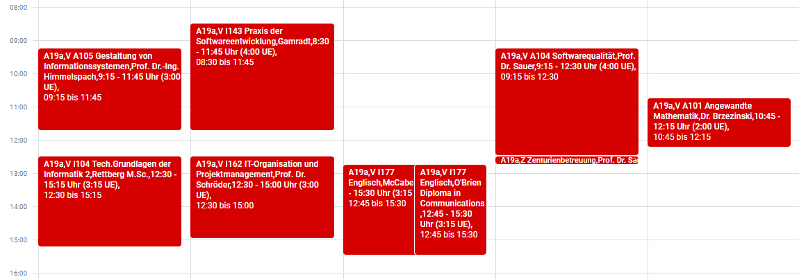

# 🗓️ Schedule Cleaner

[](https://nak.coderesting.dev/)
[](https://github.com/jeff-saupe/ScheduleCleaner/blob/master/LICENSE)
[](https://github.com/jeff-saupe/ScheduleCleaner/issues)
[](https://github.com/jeff-saupe/ScheduleCleaner/releases)



## 📖 Usage
There are two ways to use the **Schedule Cleaner**.

### Option 1: Generate a local .ics file via Command Line
Download and start **run.bat** from the releases or execute the JAR via command line:

`java -jar ScheduleCleaner.jar`

The generated .ics file can be imported to your desired calendar application.

### Option 2: Import or download the schedule via URL
Adding the URL to your calendar application allows **live updates** on changes.

1. Within your calendar application, locate the settings where you can add a calendar by URL. <br>
   - [Guide for Google Calendar](https://support.google.com/calendar/answer/37100#:~:text=Use%20a%20link%20to%20add%20a%20public%20calendar)
   - **Note**: With Google Calendar, it can take up to [12 hours until the calendar is synchronised again.](https://support.google.com/calendar/answer/37100?hl=en&ref_topic=1672445/#:~:text=It%20might%20take%20up%20to%2012%20hours%20for%20changes%20to%20show%20in%20your%20Google%20Calendar.)
2. Use the following URL and replace **\<centuria\>** and **\<semester\>** with your corresponding details: <br>
   - **Alternative 1:** `http://schedulecleaner.nak.coderesting.dev/cleaned-schedule/<centuria>_<semester>.ics`
   - **Alternative 2:**
`https://schedule-cleaner.herokuapp.com/cleaned-schedule/<centuria>_<semester>.ics`

**The URL can also just be used to download the ICS file.**


## 🛠️ Apply additional fixes
Within the class `ScheduleCleaner.java` there is a method called `initFixes()`.
There you can add two types of fixes:

### Update a title
This fix is used to update / rename the title of an event. _(In the ICS context, this is known as the summary.)_

```java
UpdateTitle updateTitle = new UpdateTitle("Tech.Grundlagen der Informatik 2", "TGdI");
fixes.add(updateTitle);
```

This fix will check for any events whose title (summary) **contains** the phrase `Tech.Grundlagen der Informatik 2` and replaces it with `TGdI`.

### Exclude an event
This fix is used to exclude a specific event.

```java
ExcludeEvent excludeEvent = new ExcludeEvent("Text1", ...); // An infinite amount of parameters can be used here by seperating them with commas
fixes.add(excludeEvent);
```

This fix will exclude any events that **contain** the phrases `Text1` **and**, if provided, all other distributed parameters.


## 💡 Contribute
Feel free to submit pull requests, open new issues or just spread the word about this [NAK Tool](https://nak.coderesting.dev/).
